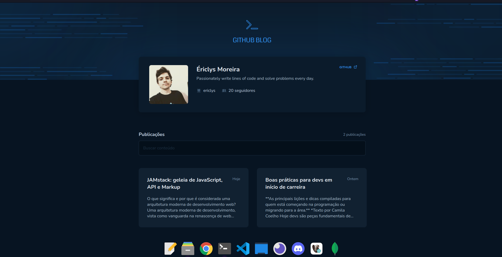

<span align="center">
  
</span>

<span align="center">
  
</span>

## 💻 Project

This project is a github based blogging app where issues will come in posts.

</br>
</br>

## ⚙ Technologies
This project was developed with the following technologies:

- [Vite](https://vitejs.dev)
- [ReactJS](https://reactjs.org)
- [TypeScript](https://www.typescriptlang.org/)
- [Styled Components](https://styled-components.com)
- [Github Api](https://docs.github.com/en/rest?apiVersion=2022-11-28)

## 👷 How to run 🚀

Install the dependencies of each project:
```bash
# Install the dependencies
$ npm i
# Start the project
$ npm run dev
```

## 🔖 Layout

- [Figma](https://www.figma.com/file/xi9g3H6s9wdUpsbMZX0kBM/GitHub-Blog-(Community)?t=yArnzyblE29ULWHZ-0)

## 📝 License

- [LICENSE](License.md).
